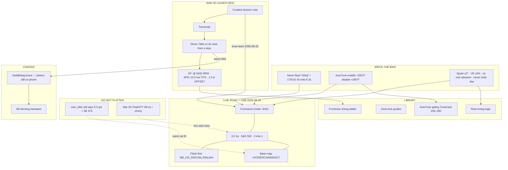

# ThunderMax topo (repo copy)

Canonical Obsidian canvas lives in the office vault:

- Mac: `~/work/ai-profit-venture/brain/thundermax_topo.canvas`
- Tower: `/home/joshua/Projects/ai-profit-venture/brain/thundermax_topo.canvas`

This file is the GitHub-readable copy. Open the `.canvas` in Obsidian for the native map.

# ThunderMax topo

Native Obsidian map of ThunderMax intel. Open the canvas (not the graph view) to pan the terrain:

**[[thundermax_topo.canvas]]**

![[thundermax_topo.canvas]]

Green = live shop fact (flash this). Red = conflict or brick-the-bike. Orange = Mar 30 session. Cyan = tower assistant. Yellow = saddlebag brace. Purple = iCloud manuals.

Hubs: [[thundermax_command_center_2026-08-19]] · [[user_bike]] · [[chatgpt_shares]]

## Terrain

## How to read it

1. Start at **LIVE PEAK**. That is what is on the bike if you flash today.
2. Left ridge is the **injector fight** (5.5 vs 68 vs 6.3). Do not average them. 6.3 wins until Joshua says otherwise.
3. Below the peak is the **Mar 30 ride complaint** — launch bog, 32° at 5,632 RPM, lean small-TPS AFR. That session is in the tower KB.
4. Right ridge is the **assistant**: `:8181`, GitHub, never writes `.tbw`.
5. Far right/below is **fab** (brace), not ECM.
6. Bottom shelf is the **manual pile**. Use it for protocol, not as current hardware.

## Key file nodes on the canvas

- [[thundermax_command_center_2026-08-19]]
- [[user_bike]]
- [[thundermax_usb_tmax_flash_rules_6-3_vs_55inj_2026-08-19]]
- [[thundermax_ch_home_autotune_330-345f_above_280f_gate_2026-08-19]]
- [[thundermax_chatgpt_share_2026-03-30_lowrider-st-131]]
- [[thundermax_chatgpt_share_2026-03-30_transcript]]
- [[chatgpt_share_2026-08-07_saddlebag-brace-project-plan]]
- [[icloud_thundermax_ai_project_2025-08-30_autotune_gating_tunecard_pdf_465fb7]]
- [[icloud_thunder_max_tuning_thundermax_rear_timing_logic_pdf_b96c1c]]
- [[icloud_thunder_max_tuning_m8_131ci_timing_tables_front_and_rear_pdf_9e7b0b]]
